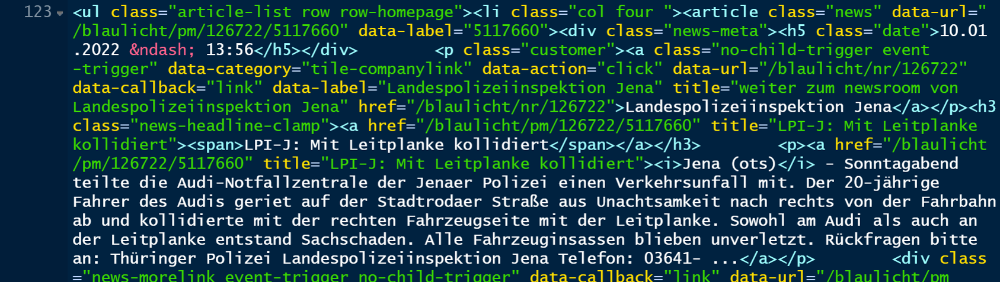

```{r setup, include=FALSE}
knitr::opts_chunk$set(echo = TRUE)

library(tidyverse)
library(leaflet)
town <- "Jena"

```

Kategorien: "Web-Mapping", "Web-Scraping", "Geocodierung", "Jena"

Tags: "Web-Mapping", "Web-Scraping", "Geocodierung", "Geoparsing", "ALKIS", "offene Geodaten Thüringen", "Unfälle", "Einbrüche", "crime map", "Jena", "Erfurt", "Weimar", "Gera"

Wo um mich herum wird eingebrochen, wo passieren Unfälle? Während es in Nordamerika üblich ist, die Antwort darauf zeitnah im Web aus interaktiven Online-Karten zu bekommen (z.B. [Toronto](https://torontops.maps.arcgis.com/apps/webappviewer/index.html?id=5f74f910b2ea4e85a370014921cdecbd)), muss man in Deutschland noch die [Berichte der Polizei](https://www.presseportal.de/blaulicht/r/Jena) aufmerksam lesen, um sich ein Bild davon zu machen.

Oder kann das nicht der Computer für mich übernehmen?

Die geographische Datenwissenschaft kann uns tatsächlich weiterhelfen. Was müssen wir tun?

1. **Web-Scraping**: Die von der Thüringer Polizei veröffentlichten Berichte einlesen und enthaltene Informationen extrahieren.
2. **Geoparsing**: Straßennamen erkennen und herausfiltern.
3. **Geocodierung**: Die Straßennamen in Koordinaten umwandeln.
4. **Web-Mapping**: Ein interaktives Kartendisplay fürs Web erzeugen.

Klingt kompliziert? Wer im [Geoinformatik-Studium bei uns in Jena](https://www.uni-jena.de/msc_geoinformatik) aufgepasst hat, wird keine Schwierigkeiten damit haben... ;-) Hier eine schnelle und einfache Lösung, die noch nicht das Letzte aus den Daten herausholt, aber für einen Samstagnachmittag doch recht ordentlich ist. (In der repo auf Github gibt es eine noch etwas ausgefeiltere Lösung.)

Ich verwende hierfür die [freie Statistik-Software R](https://www.r-project.org/) mit den Packages [`rvest`](https://rvest.tidyverse.org/), [`sf`](https://geocompr.robinlovelace.net/spatial-class.html) und [`leaflet`](https://rstudio.github.io/leaflet/) sowie [offene Thüringer Geodaten](https://www.geoportal-th.de/de-de/) der [ALKIS-Datenbank](https://tlbg.thueringen.de/liegenschaftskataster/alkis). (In vielen anderen Bundesländern sind diese Daten leider nicht frei zugänglich, aber es ließen sich auch andere offene Quellen anzapfen.)

### Web-Scraping: Informationen aus dem Web ernten

Nicht nur Menschen, sondern auch Computerprogramme -- sogenannte Bots -- können Webseiten lesen und die Inhalte verarbeiten. Das ist unter bestimmten Voraussetzungen völlig legal und wird tagtäglich für alle möglichen Zwecke eingesetzt, aber ich empfehle, stets vorher die rechtlichen Rahmenbedingungen zu prüfen und rücksichtsvoll von den technischen Möglichkeiten Gebrauch zu machen.

Die Thüringer Polizei stellt ihre Berichte direkt in [presseportal.de](https://www.presseportal.de/blaulicht/r/Jena) ein, wo sie auf Seiten wie dieser übersichtsartig dargestellt sind:

```{r, echo=FALSE, out.width='70%'}

```

Die Inhalte und Formatierungen der Webseiten liegen dabei im HTML-Format vor, hier ein kleiner Ausschnitt:

```{r, echo=FALSE, out.width='70%'}

```

... welches sich mit [`rvest`](https://rvest.tidyverse.org/)-Funktionen in R analysieren lässt. In einfachster Form sieht das so aus, wobei mir sehr gelegen kommt, dass die Polizeiberichte einfach in Links der Form `https://www.presseportal.de/blaulicht/r/Jena` enthalten sind.

```{r scraping, echo=TRUE}
library(tidyverse)
library(rvest)
# Webseite lesen:
html <- read_html(url("https://www.presseportal.de/blaulicht/r/Jena"))

# HTML-Abschnitte mit Polizeiberichten filtern:
x <- html %>% html_nodes("a") # handelt sich um HTML-Links
sel <- x %>% html_attr("class") %>% is.na()
x <- x[sel] # nur Links ohne Klassenattribut
sel <- x %>% html_attr("href") %>% str_detect("/blaulicht/pm/")
x <- x[sel] # mit bestimmtem URL-Muster
unsel <- x %>% html_node("i") %>% is.na()
x <- x[!unsel] # und es gibt immer was mit <i>...</i>
sel <- x %>% html_attr("title") %>% str_detect("^LPI-")
x <- x[sel] # nur Landespolizeiinspektion

# Ergebnisse extrahieren und bündeln:
d <- data.frame(
  url = html_attr(x, "href"),
  title = html_attr(x, "title"),
  town = html_text(x) %>% 
    str_extract("^.* \\(ots\\)") %>%
    str_remove(" \\(ots\\)"),
  text = html_text(x)
)

# Nur Polizeiberichte aus Jena:
sel <- !is.na(d$town) & str_starts(d$town, "Jena")
d <- d[sel,]
```

Damit haben wir schon eine Tabelle mit den Meldungen (Titel und Text), ihrem Ort (auf Jena eingeschränkt), und jeweils einer weiterführenden URL. Insgesamt sind es `r nrow(d)`, hier nur die ersten drei:

```{r}
d[1:3, 1:3]
```

### Geoparsing: Toponyme in Texten entdecken

Die Berichte enthalten zwar keine genauen Koordinaten der Vorfälle, wohl aber in den meisten Fällen Straßennamen, also spezielle Toponyme. Das Auffinden von Toponymen in Texten, also das sogenannte **Geoparsing**, kann eine ganz schöne Herausforderung sein, weil es wahnsinnig viele Toponyme gibt und diese auch noch "normalen" Wörtern ähneln können -- erst kürzlich betreute ich mit [Dr. Xuke Hu](https://scholar.google.de/citations?user=xCj17L0AAAAJ&hl=en) vom [DLR-institut Jena](https://www.dlr.de/dw/de/desktopdefault.aspx/tabid-12200/21397_read-49437/) die [Abschlussarbeit von Tim Grünemay](https://elib.dlr.de/146332/) zum Geoparsen von Social-Media-Nachrichten.

Zum Glück haben wir es hier etwas leichter als Tim: Die Polizeiberichte sind (meist) sehr präzise in den Ortsbezeichnungen, Rechtschreibfehler sind eine Rarität, und in Jena gibt es nur eine begrenzte Anzahl Straßennamen -- genau genommen `r nrow(readRDS("Jena_streets.rds"))``. (Dafür fehlen Hausnummern, so dass die Lagegenauigkeit leider nicht optimal sein wird.)

Aus [ALKIS-Daten](https://tlbg.thueringen.de/liegenschaftskataster/alkis), die eigentlich auf sogar Gebäudeebene vorliegen, habe ich daher zunächst einen Straßendatensatz erzeugt ([hier verfügbar](Jena_streets.rds))...

```{r, echo=TRUE}
streets <- readRDS("Jena_streets.rds")
```

... der so aussieht:

```{r, echo=FALSE}
kbl <- streets[1:7, c("STN", "lat", "lon")]
rownames(kbl) <- NULL
kableExtra::kbl(kbl, decimal.mark = ",")
rm(kbl)
```

Mit einfachen Textvergleichen können wir nun die im Polizeibericht vorkommenden Jenaer Straßennamen auffinden; nur für den Markt habe ich mir eine Sonderregel audgedacht, um nicht auf jeden Super*markt* im Text hereinzufallen:

```{r}
# Geoparsing-Funktion:
geoparse <- function(x, streets) {
  sel <- sapply(streets$STN, function(y) any(grepl(y, x, ignore.case = TRUE)))
  sel <- streets$STN[sel]
  if ((length(sel) > 1) & any(sel == "Markt"))
    sel <- sel[ sel != "Markt" ] # "Markt" weg, wenn auch Straße angegeben
  sel
}
# Probier's aus:
geoparse(d$text[1], streets = streets)
```

Jetzt müssen wir nur noch die Koordinaten der Straßen finden und diese auf die Karte bringen!

### Geocodierung: Toponyme in Koordinaten umwandeln

Da die ALKIS-Daten (bzw. mein abgeleiteter Straßendatensatz) auch Koordinaten enthält, können wir diese nun anhand des Straßennamens nachschlagen -- das ist die **Geocodierung**, eine essentielle Operation in vielen Anwendungen vom Geomarketing bis zur Routenfindung.

Wenn mehr als ein Straßenname vorliegt, nehme ich ihren Mittelwert. (Den Kreuzungspunkt zu finden, ist Fleißarbeit, die ich dir überlasse!)
So sieht das aus:

```{r geocode}
# Funktion zum Geocodieren von Straßennamen:
geocode <- function(x, streets) {
  sel <- streets$STN %in% x
  data.frame( # Median, falls es mehrere sind:
    lat = median(streets$lat[sel]),
    lon = median(streets$lon[sel]),
    streets = paste(x, collapse = ", ")
  )
}
# Probier's aus:
geocode("Stadtrodaer Straße", streets = streets)
geocode(c("Löbdergraben", "Sonnenhof"), streets = streets)
```

Damit sind wir bereit, das Geoparsing und die Geocodierung hintereinander auf alle Texte loszulassen:

```{r workflow}
xy <- d$text %>% map(geoparse, streets = streets) %>% 
  map(geocode, streets = streets) %>% bind_rows()
d <- cbind(d, xy)
d <- d[!is.na(d$lat), ] # nur Berichte mit Koordinaten
```

Von den `N_total` gefundenen Berichten konnten wir immerhin `r nrow(d)` Exemplare geocoderen. Es gibt auch zahlreiche Geocodierdienste im Internet, aber es schon sehr praktisch, dass wir in Thüringen direkt auf freie ALKIS-Daten zugreifen können!

### Web-Mapping: interaktive Karten im Web erstellen

Jetzt auf die Karte damit! Die Darstellung übernimmt für uns ein Package namens [`leaflet`](https://www.earthdatascience.org/courses/earth-analytics/get-data-using-apis/leaflet-r/), welches wiederum offene Geodaten z.B. von [OpenStreetMap](https://www.openstreetmap.de/) im Hintergrund einblendet.

```{r plainmap, eval=FALSE, echo=TRUE}
library(leaflet)
d$popup <- paste0('<a href="https://www.presseportal.de', d$url, '">', 
                  '<h3>', d$title, '</h3></a><p>',
                  d$streets, "<p>", d$text, "<p>", 
                  "Quelle: Polizei via presseportal.de ")
leaflet() %>% addTiles() %>%
  addMarkers(lat = d$lat, lng = d$lon, popup = d$popup,
             clusterOptions = markerClusterOptions())
```

Ich habe die obige Analyse noch ein bisschen ausgedehnt und verfeinert und damit in etwa ein Jahr an Polizeiberichten geocdert. Das Ergebnis sieht so aus:
**Wichtiger Hinweis: Die Lage der Ereignissestimmt bestenfalls(!) auf Straßenebene und kann in Einzelfall auch ganz falsch sein! Es wird keinerlei Gewähr für die Richtigkeit der Informationen übernommen! Die vollständigen Original-Berichte sind verlinkt.**

**TURN INTO CALLOUT**


```{r map, echo=FALSE}
d <- readRDS("Jena_geocoded_reports.rds")

reference <- "Quelle: Polizeidienststellen via www.presseportal.de"

d$popup <- paste0('<a href="https://www.presseportal.de', d$url, '">',
                  '<h3>', d$title, '</h3></a><p>',
                  d$datetime, "<br>",
                  d$streets, "<p>",
                  d$text, "<p>", 
                  reference)
leaflet() %>% addTiles() %>%
  addMarkers(lat = d$lat, lng = d$lon, popup = d$popup,
             clusterOptions = markerClusterOptions())
```


Und schon sind wir fertig!

Bei genauerer Betrachtung fallen uns zwar noch ein paar Fehler auf, mit denen sich vielleicht noch jemand in einer Abschlussarbeit auseinandersetzen möchte! Ich habe das gleich für alle größeren Städte in Thüringen gemacht:

- Die Lichtstadt Jena
- Unsere Landeshauptstadt Erfurt
- Die Kulturstadt Weimar
- Die Stadt Gera

<!--
Der zugehörige Code ist in einer Github-Repo unter einer Open-Source-Lizenz verügbar.
-->


### Relevante Links

- Landespolizeiinspektion Jena <https://polizei.thueringen.de/landespolizeiinspektionen/lpijena/pressestelle>
- Newsroom der Landespolizeiinspektion Jena <https://www.presseportal.de/blaulicht/nr/126722>
- Neue Datenanalyse-Software für die Thüringer Polizei <http://www.geobranchen.de/mediathek/geonews/item/neue-datenanalyse-software-f%C3%BCr-die-th%C3%BCringer-polizei>
- Aktuelle Toronto Crime Map <https://torontops.maps.arcgis.com/apps/webappviewer/index.html?id=5f74f910b2ea4e85a370014921cdecbd>
